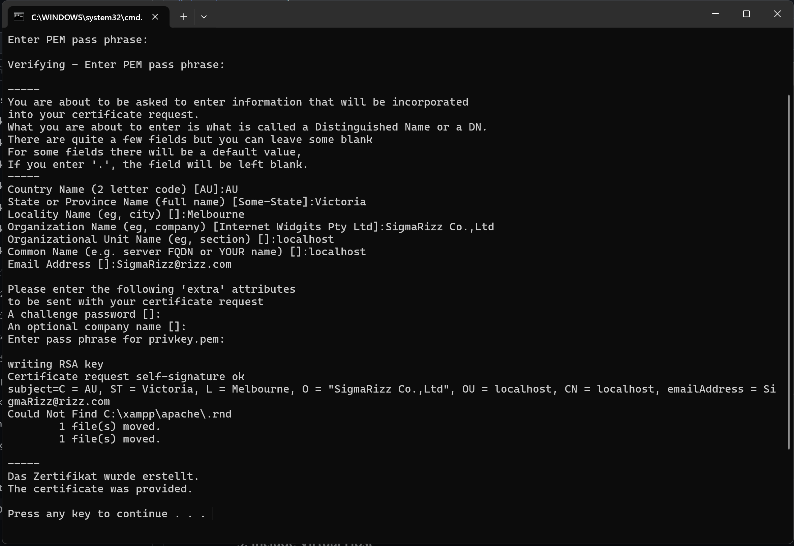
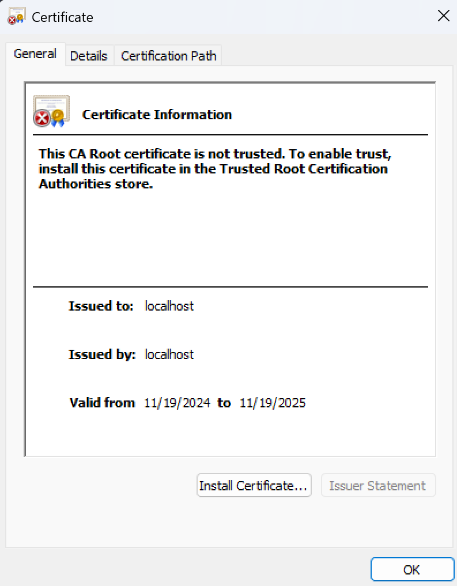
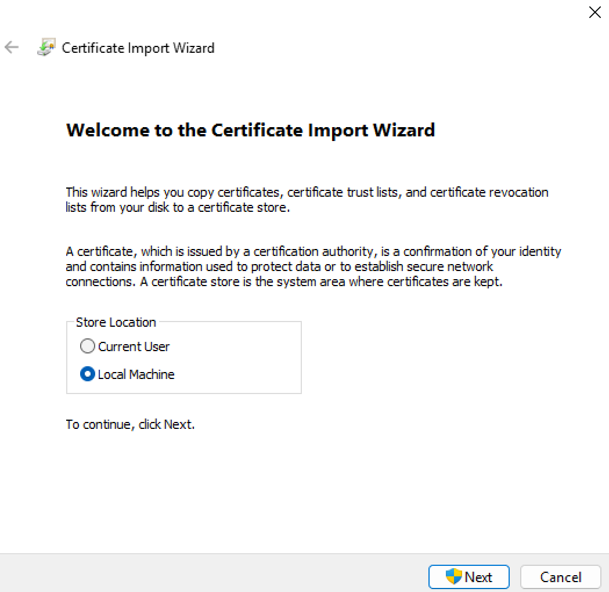
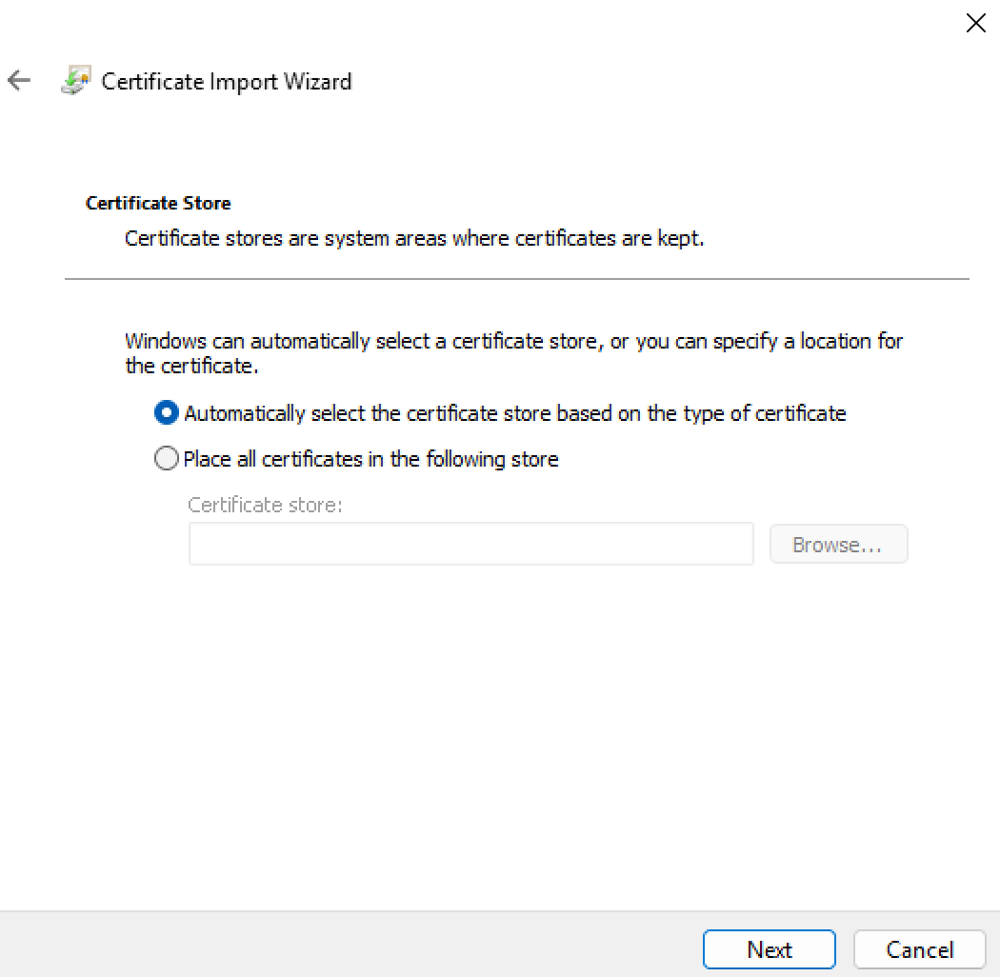
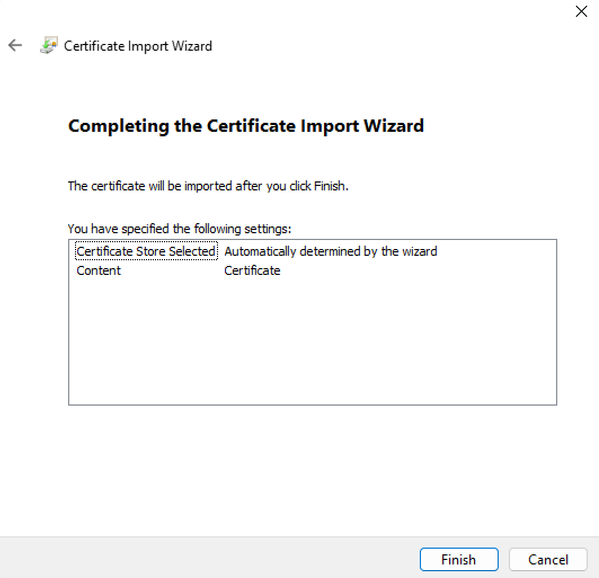
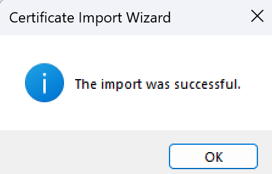

# DBMS Library System: Road to Sigma Rizz DBA, for B27 database technology CS GC

## SSL Encryption Set Up

### 1. Create Virtual Host
Add the following lines at the end of `httpd-vhosts.conf` file located in `.../xampp/apache/conf/extra`. The port can change based on your need but by default it is port 80. Yet, if you are using other ports additional set ups are required.
```apache
<VirtualHost *:80>
   DocumentRoot "C:/xampp/htdocs/"
   ServerName localhost
   SSLEngine on	
   SSLCertificateFile "conf/ssl.crt/server.crt"
   SSLCertificateKeyFile "conf/ssl.key/server.key"
   <Directory "C:/xampp/htdocs/">
    Options All
    AllowOverride All
    Require all granted
   </Directory>
   ErrorLog "logs/dummy-host2.example.com-error.log"
   CustomLog "logs/dummy-host2.example.com-access.log" common
 </VirtualHost>
```
### 2. Create Certificate
Generate SSL Certificate by running `makecert.bat` in `xampp/apache` and fill in your data. You can simply enter to fill the data with its default data provided.

After the setup, the files `ssl.crt/server.crt` and `ssl.key/server.key` should be created in `.../xampp/apache/conf`. These are the files needed for apache to validate the security protocol.
### 3. Modifying Virtual Host
Add the following line at the end of `httpd.conf` file located in `.../xampp/apache/conf`
```apache 
Include conf/extra/httpd-vhosts.conf
```
### 4. Install Certificate
To install the certificate open `server.crt` located in `.../xampp/apache/conf/ssl.crt` and follow the following steps:
#### Step 1: 


#### Step 2:


#### Step 3:


#### Step 4:


#### Step 5:


### 5. Checking
If the server only runs when in `https://localhost` and return `400: Bad Gateway` in `localhost` then you have finished setting up ssl encryption.

## Backup and Restore

### 1. Create bat file
This bat file will act as the file the backups the database. Code may vary depending on your `file location` and `variable names`. This script is made on `Windows` operating system.
```php
@echo off
set BACKUP_DIR="E:\-- Semester 3\Database Technology\BackUp and Restoration"
set DATABASE_NAME=library

for /f "tokens=2 delims==" %%I in ('wmic OS GET localdatetime /VALUE') do set datetime=%%I

set YYYY=%datetime:~0,4%
set MM=%datetime:~4,2%
set DD=%datetime:~6,2%
set HH=%datetime:~8,2%
set MIN=%datetime:~10,2%
set SS=%datetime:~12,2%

set TIMESTAMP=%YYYY%-%MM%-%DD%_%HH%-%MIN%-%SS%
set MYSQL_USER=admin
set MYSQL_PASSWORD=password

"C:\xampp\mysql\bin\mysqldump.exe" -u %MYSQL_USER% -p%MYSQL_PASSWORD% %DATABASE_NAME% > %BACKUP_DIR%\backup_%DATABASE_NAME%_%TIMESTAMP%.sql

if %ERRORLEVEL% EQU 0 (
    echo Backup completed successfully.
) else (
    echo Backup failed. Check your settings and permissions.
)
pause
```

### 2. Create the user
Run the following query with `username` and `password` same as what you wrote in the `backup.bat` file.
```sql
CREATE USER 'admin'@'localhost' IDENTIFIED BY 'password';
GRANT 'admin' TO 'admin'@'localhost';
```

### 3. Automate the backup
In `Windows`, the `Task Scheduler` can help you create automatic recurring runs for the `backup.bat` file.
#### Step 1:


#### Step 2:


#### Step 3:


#### Step 4:


#### Step 5:
