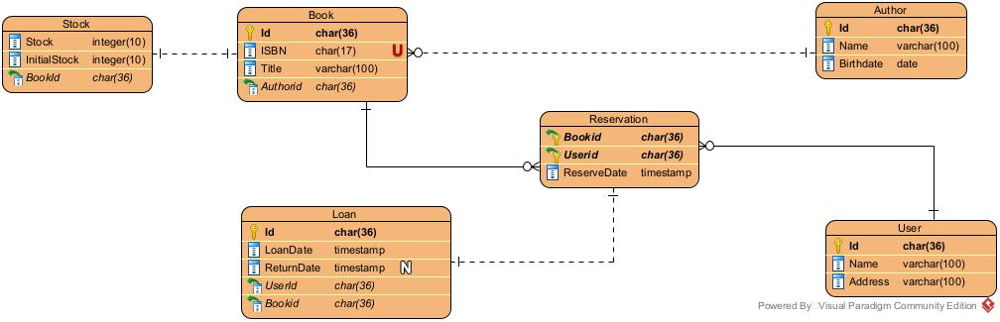
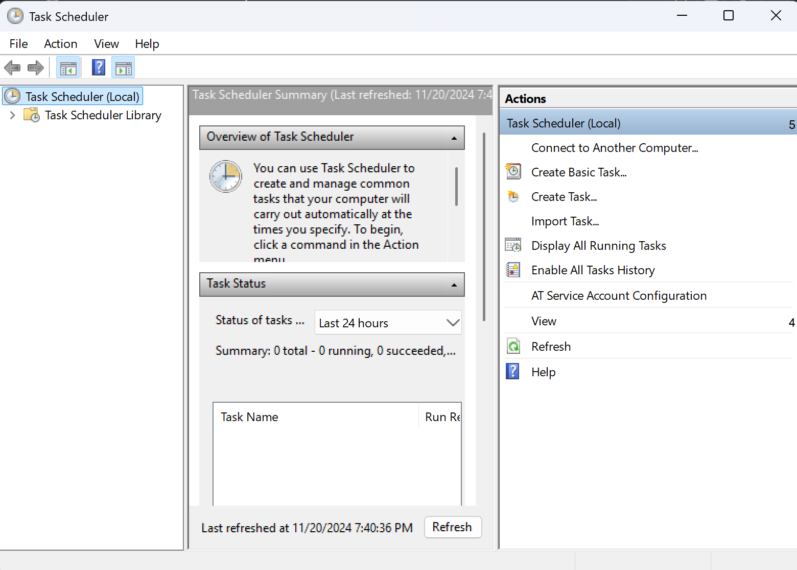
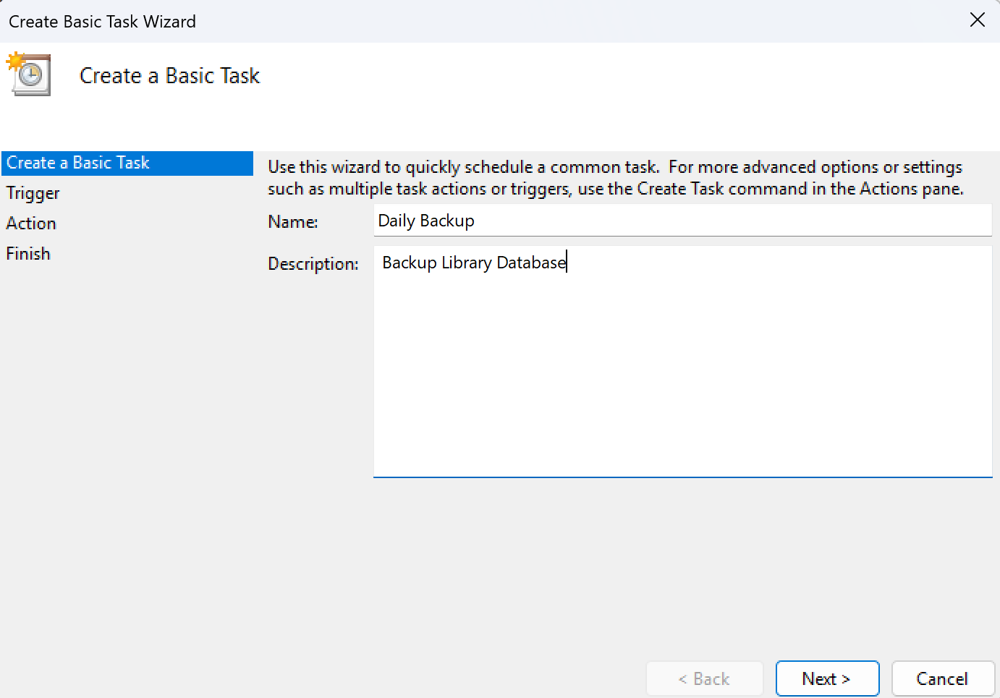
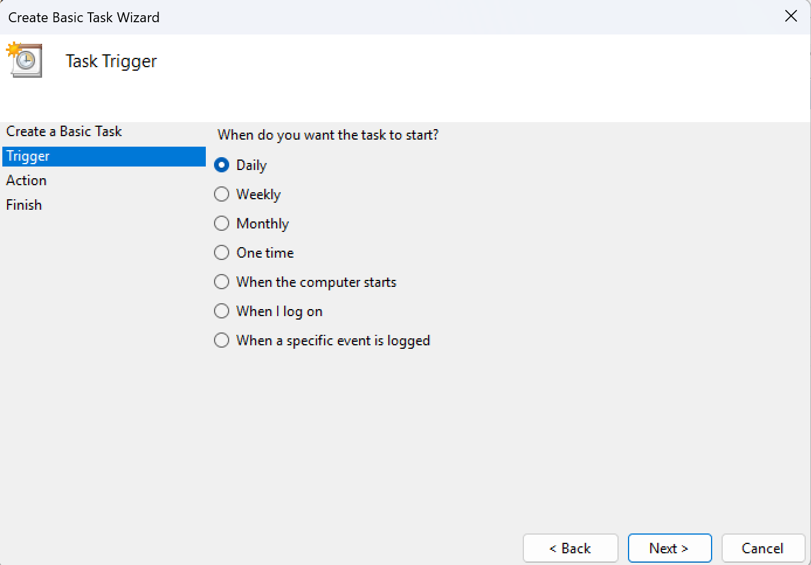
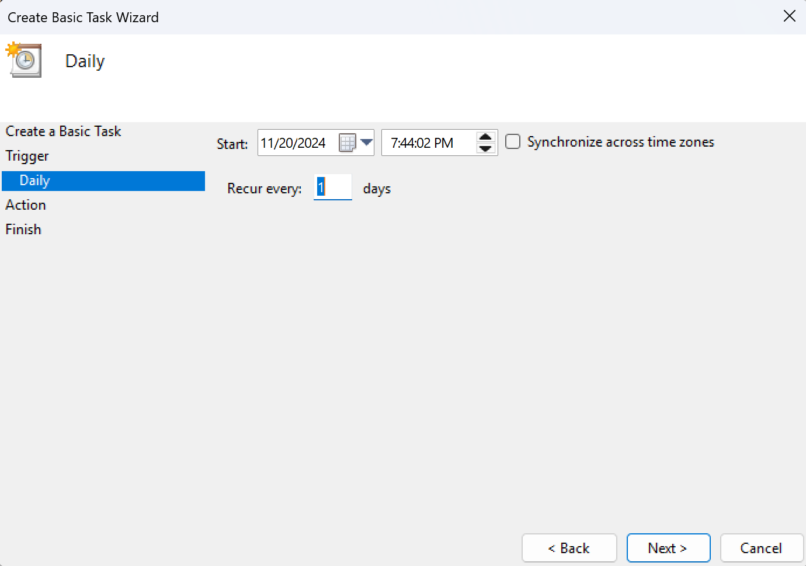
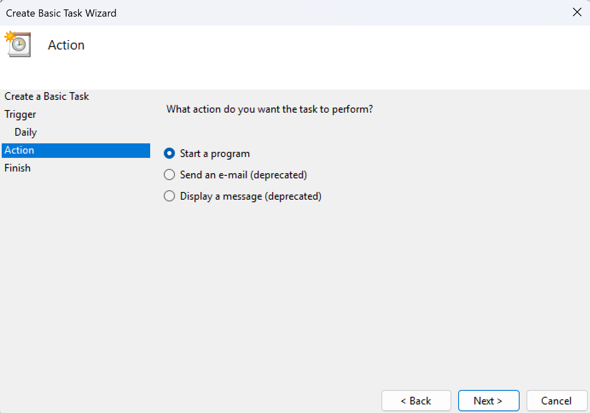
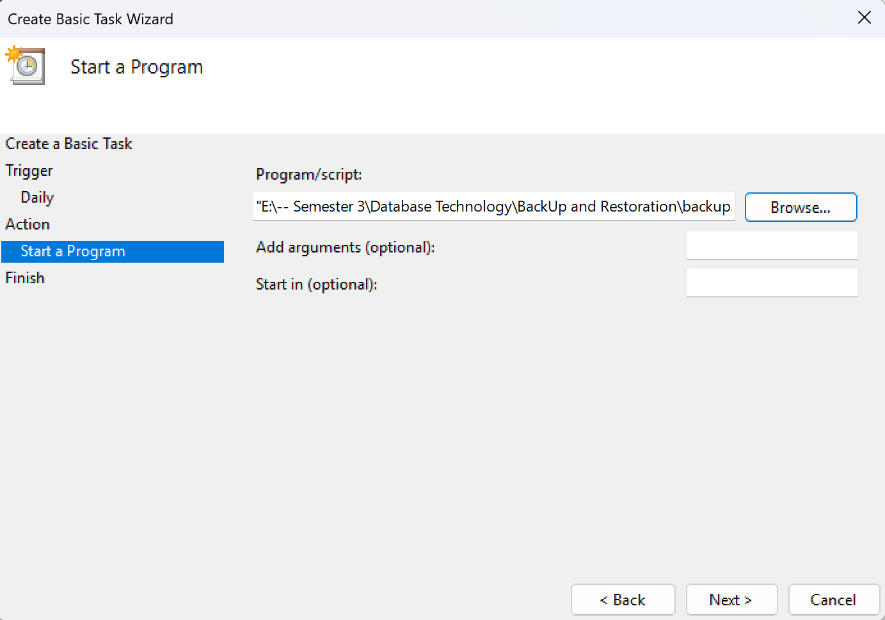
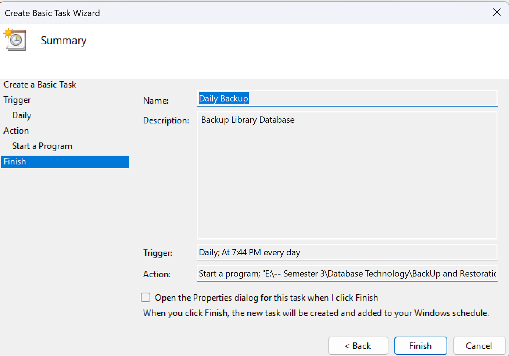

# DBMS Library System: Road to Sigma Rizz DBA, for B27 database technology Computer Science Global Class

This project is a database management system project that is developed with mySQL MariaDB for the needs of B27's Database Technology course. The management system includes several important aspects of DBMS, from `indexing`, `storage management`, `procedures and triggers` to `full text search` and `backup and restoration`. 

## Design Creation
Entity Relationship Diagram:
The Entity Relationship Diagram below is created with having 6 tables which are `User`, `Author`, `Book`, `Stock`, `Reservation`, and `Loan`.



## Schema Creation
Entities and Relationships:
### 1. User
```sql
CREATE TABLE `User` (
    Id CHAR(36) PRIMARY KEY DEFAULT UUID(),
    Name VARCHAR(100) NOT NULL,
    Address VARCHAR(100) NOT NULL
) ENGINE = InnoDB;
```
The table has the following relationship:\
One `User` can have many `Reservations`

The table has the following attributes:\
| Attributes     | Description                                                                     |
|----------------|---------------------------------------------------------------------------------|
|`Id`            | The unique idenfier of the table which is configured with UUID [`PRIMARY KEY`] |
|`Name`          | The name of the user |
|`Address`       | The address of the user |

### 2. Author
```sql
CREATE TABLE Author (
    Id CHAR(36) PRIMARY KEY DEFAULT UUID(),
    Name VARCHAR(100) NOT NULL,
    Birthdate date NOT NULL,
    FULLTEXT(Name)
) ENGINE = InnoDB;
```
The table has the following relationship:\
One `Author` can have many `Books`

The table has the following attributes:\
| Attributes     | Description                                                                     |
|----------------|---------------------------------------------------------------------------------|
|`Id`            | The unique identifier of the table which is configured with UUID [`PRIMARY KEY`] |
|`Name`          | The name of the author. Added `FULLTEXT` for fast searching. |
|`Birthdate`     | The birthdate of the author |

### 3. Book
```sql
CREATE TABLE Book (
    Id CHAR(36) PRIMARY KEY DEFAULT UUID(),
    ISBN CHAR(17) UNIQUE NOT NULL,
    CHECK(ISBN REGEXP'^(978|979)-[0-9]{1,5}-[0-9]{1,7}-[0-9]{1,7}-[0-9]$'),
    Title VARCHAR(100) NOT NULL,
    AuthorId VARCHAR(100) NOT NULL,
    FOREIGN KEY (AuthorId) REFERENCES Author(Id) ON UPDATE CASCADE ON DELETE CASCADE,
    FULLTEXT(Title)
) ENGINE = InnoDB;
```
The table has the following relationship:\
One `Book` can have many `Reservation` but can only have one `Stock`

The table has the following attributes:\
| Attributes     | Description                                                                     |
|----------------|---------------------------------------------------------------------------------|
|`Id`            | The unique identifier of the table which is configured with UUID [`PRIMARY KEY`] |
|`ISBN`          | The unique code of each book. Added `CHECK` to make sure the `ISBN` is valid. |
|`Title`         | The book title. Added `FULLTEXT` for fast searching. |
|`AuthorId`      | Refers to the `Id` of the `Author` [`FOREIGN KEY`] |

## 4. Stock
```sql
CREATE TABLE Stock (
    BookId CHAR(36) PRIMARY KEY,
    Stock INT NOT NULL,
    CHECK(Stock >= 0 AND Stock <= InitialStock),
    InitialStock INT NOT NULL,
    FOREIGN KEY (BookId) REFERENCES Book(Id) ON UPDATE CASCADE ON DELETE CASCADE
) ENGINE = InnoDB;
```
The table has the following relationship:\
One `Stock` can only be linked to one `Book`

The table has the following attributes:\
| Attributes     | Description                                                                     |
|----------------|---------------------------------------------------------------------------------|
|`Id`            | The unique identifier of the table which is configured with UUID [`PRIMARY KEY`] |
|`Stock`         | The current available stock |
|`Initial Stock` | The total stock the library has including the books borrowed |
|`BookId`        | Refers to the `Id` of the `Book` [`FOREIGN KEY`] |

### 5. Reservation
```sql
CREATE TABLE Reservation (
    BookId CHAR(36) NOT NULL,
    UserId CHAR(36) NOT NULL,
    ReserveDate TIMESTAMP NOT NULL DEFAULT CURRENT_TIMESTAMP,
    PRIMARY KEY(BookId, UserId),
    FOREIGN KEY (BookId) REFERENCES Book(Id) ON UPDATE CASCADE ON DELETE CASCADE,
    FOREIGN KEY (UserId) REFERENCES `User`(Id) ON UPDATE CASCADE ON DELETE CASCADE
) ENGINE = InnoDB;
```
The table has the following relationship:\
One `Reservation` can only be linked to one `Book` and one `User` and can only have one `Loan`

The table has the following attributes:\
| Attributes        | Description                                                                     |
|-------------------|---------------------------------------------------------------------------------|
|`BookId`           | Refers to the `Id` of the `User` [`FOREIGN KEY`] |
|`UserId`           | Refers to the `Id` of the `Book` [`FOREIGN KEY`]  |
|`Reservation Date` | The time the book is reserved |

### 6. Loan
```sql
CREATE TABLE Loan (
    Id CHAR(36) PRIMARY KEY DEFAULT UUID(),
    LoanDate TIMESTAMP NOT NULL DEFAULT CURRENT_TIMESTAMP,
    ReturnDate TIMESTAMP NULL,
    BookId CHAR(36) NOT NULL,
    UserId CHAR(36) NOT NULL,
    FOREIGN KEY (UserId) REFERENCES `User`(Id) ON UPDATE CASCADE ON DELETE CASCADE,
    FOREIGN KEY (BookId) REFERENCES Book(Id) ON UPDATE CASCADE ON DELETE CASCADE
) ENGINE = InnoDB;
```
The table has the following relationship:\
One `Loan` can only be linked to one `Reservation`

The table has the following attributes:\
| Attributes     | Description                                                                     |
|----------------|---------------------------------------------------------------------------------|
|`Id`            | The unique identifier of the table which is configured with UUID [`PRIMARY KEY`] |
|`LoanDate`      | The time the book is loaned |
|`Return Date`   | The time the book is returned |
|`BookId`        | Refers to the `Id` of the `Book` from the table `Reservation` [`FOREIGN KEY`] |
|`UserId`        | Refers to the `Id` of the `User` from the table `Reservation` [`FOREIGN KEY`] |

## Storage and Memory Management
The amount of memory buffer and cache is determined by a storage engine. In mySQL MariaDB by default it already uses the storage engine `innoDB` that will create `.ibd` files in `xampp/mysql/data/library`. Yet, it is also possible to specify the storage engine of each table as follows, taking table `User` as an example:
```sql
CREATE TABLE `User` (
    Id CHAR(36) PRIMARY KEY DEFAULT UUID(),
    Name VARCHAR(100) NOT NULL,
    Address VARCHAR(100) NOT NULL
) ENGINE = InnoDB;
```
mySQL MariaDB by default also already have set the size of each table. Yet, is is also possible to specify the size based on what you want as follows:
```sql
SET GLOBAL innodb_buffer_pool_size = 8 * 1024 * 1024 * 1024;     -- 8 GB
SET GLOBAL query_cache_size = 64 * 1024 * 1024;                  -- 64MB
```

## Indexing
The point of using indexing is for a **faster** and more **efficient** searching, when columns are with the `WHERE` clause. Yet, the downsides of using indexing is slower `INSERT` and `UPDATE`.
### 1. User
```sql
CREATE INDEX userNameIndex ON `User`(Id);
```
| Variable       | Description                                                                     |
|----------------|---------------------------------------------------------------------------------|
|`userNameIndex` | Faster retreving data for `Reservation` and `Loan` |

### 2. Author
```sql
CREATE INDEX authorIdIndex ON Author(Id);
```
| Variable       | Description                                                                     |
|----------------|---------------------------------------------------------------------------------|
|`authorIdIndex` | Faster retreving data for `Reservation` and `Loan` |

### 3. Book
```sql
CREATE INDEX bookTitleIndex ON Book(Title);
CREATE INDEX bookAuthorIdIndex ON Book(AuthorId);
```
| Variable           | Description                                                                     |
|--------------------|---------------------------------------------------------------------------------|
|`bookTitleIndex`    | Faster retreving data when searching for books based on their titles |
|`bookAuthorIdIndex` | Faster retreving data when searching for books based on their author |

### 4. Loan
```sql
CREATE INDEX reservationBookIdIndex ON Reservation(BookId);
CREATE INDEX reservationUserIdIndex ON Reservation(UserId);
```
| Variable                   | Description                                                                     |
|----------------------------|---------------------------------------------------------------------------------|
|`reservationBookIdIndex`    | Faster retreving data when searching for latest reservation based on the book |
|`reservationUserIdIndex`    | Faster retreving data when searching for latest reservation based on the user |

### 5. Loan
```sql
CREATE INDEX loanLoanDateIndex ON Loan(LoanDate);
CREATE INDEX loanUserIdIndex ON Loan(UserId);
CREATE INDEX loanBookIdIndex ON Loan(BookId);
```
| Variable                   | Description                                                                     |
|----------------------------|---------------------------------------------------------------------------------|
|`loanLoanDateIndex`         | Faster retreving data when searching for loan based on the loan date |
|`loanUserIdIndex`           | Faster retreving data when searching for latest loan based on the user |
|`loanBookIdIndex`           | Faster retreving data when searching for latest loan based on the book |

## Transactions and Concurrency Control
`TRANSACTION` is a unit of work that combines several SQL operations. Validations will be applied within the `TRANSACTION` to make sure the operation will work as it should. When it is valid `COMMIT` the state, otherwise it can `ROLLBACK` the state, where the state will get reverted. To create a good DBMS, all user executed queries should use `PROCEDURE`.

In order for a `PROCEDURE`, `FUNCTION` and `TRIGGER` to run, it should be wrapped within `DELIMITER` as follows:
```sql
DELIMITER $$

CREATE PROCEDURE ... (
    ...
)
BEGIN
    ...
END $$

CREATE FUNCTION ... (
    ...
)
RETURNS ...
BEGIN
    ...
END $$

CREATE TRIGGER ...
    ...
BEGIN
    ...
END $$

DELIMITER ;
```

Below are the `PROCEDURE` and `TRIGGER` used in this project:
### 1. Add Book
```sql
CREATE PROCEDURE addBook (
    IN book_title VARCHAR(100),
    IN book_authorId CHAR(36),
    IN book_ISBN CHAR(17),
    IN book_stock INT
)
BEGIN
    DECLARE book_id CHAR(36);

    START TRANSACTION;

    IF NOT EXISTS (SELECT 1 FROM Author WHERE Id = book_authorId) THEN
        ROLLBACK;
        SIGNAL SQLSTATE '45000' SET MESSAGE_TEXT = 'Failed [1]: No Matching Author Id Found';
    ELSEIF book_stock < 1 OR NOT(book_stock REGEXP '^[0-9]+$') THEN
        ROLLBACK;
        SIGNAL SQLSTATE '45000' SET MESSAGE_TEXT = 'Failed [2]: Invalid Book Stock';
    ELSEIF NOT(book_ISBN REGEXP'^(978|979)-[0-9]{1,5}-[0-9]{1,7}-[0-9]{1,7}-[0-9]$') THEN
        ROLLBACK;
        SIGNAL SQLSTATE '45000' SET MESSAGE_TEXT = 'Failed [3]: ISBN is Not Valid';
    ELSEIF LEN(book_ISBN) != 17 THEN
        ROLLBACK;
        SIGNAL SQLSTATE '45000' SET MESSAGE_TEXT = 'Failed [4]: ISBN length should be 17 characters';
    ELSE
        INSERT INTO Book(Title, ISBN, AuthorId)
        VALUES(book_title, book_ISBN, book_authorId);

        SELECT Id INTO book_id FROM book WHERE ISBN = book_ISBN;

        INSERT INTO STOCK(BookId, Stock, InitialStock)
        VALUES(book_id, book_stock, book_stock);

        COMMIT;
    END IF; 
END $$
```
This procedure checks if the book's AuthorId inputted exists in the `Author` table, the book's stock inputted is at least 1 and is a number, and the book's ISBN is valid and 17 characters long, when all validations is passed then it adds a book to the `Book` table.

### 2. Add User
```sql
CREATE PROCEDURE addUser (
    IN user_name VARCHAR(100),
    IN user_address VARCHAR(100)
)
BEGIN
    START TRANSACTION;

    INSERT INTO `User`(Name, Address)
    VALUES(user_name, user_address);

    COMMIT;
END $$
```
This procedure adds a user to the `User` table. There are no validations as empty is not able to be inputted anyway, since the data is with type `NOT NULL`.

### 3. Add Author
```sql
CREATE PROCEDURE addAuthor (
    IN author_name VARCHAR(100),
    IN author_birthdate DATE
)
BEGIN
    START TRANSACTION;

    INSERT INTO Author(Name, Birthdate)
    VALUES(author_name, author_birthdate);

    COMMIT;
END $$
```
This procedure adds an author to the `Author` table. There are no validations as empty is not able to be inputted anyway, since the data is with type `NOT NULL`.

### 4. Borrow Book
```sql
CREATE PROCEDURE borrowBook (
    IN book_id CHAR(38),
    IN user_id CHAR(38)
)
BEGIN
    DECLARE curr_stock INT;

    START TRANSACTION;

    SELECT Stock INTO curr_stock FROM Stock WHERE BookId = book_id;

    IF NOT EXISTS (SELECT 1 FROM Book WHERE Id = book_id) THEN
        ROLLBACK;
        SIGNAL SQLSTATE '45000' SET MESSAGE_TEXT = 'Failed [5]: Book Not Found';
    ELSEIF NOT EXISTS (SELECT 1 FROM `User` WHERE Id = user_id) THEN
        ROLLBACK;
        SIGNAL SQLSTATE '45000' SET MESSAGE_TEXT = 'Failed [6]: User Not Found';
    ELSEIF EXISTS (SELECT 1 FROM Loan WHERE BookId = book_id AND UserId = user_id AND ReturnDate IS NULL) THEN
        ROLLBACK;
        SIGNAL SQLSTATE '45000' SET MESSAGE_TEXT = 'Failed [7]: Book has not been Returned';
    ELSEIF curr_stock > 0 THEN 
        INSERT INTO Loan(ReturnDate, BookId, UserId)
        VALUES(NULL, book_id, user_id);

        COMMIT;
    ELSE
        INSERT INTO Reservation(BookId, UserId)
        VALUES(book_id, user_id);

        COMMIT; 
    END IF;
END $$
```
This procedure checks if the book's id inputted exists in the `Book` table, the user's id inputted exists in the `User` table, and by some odds the user wants to borrow the same book with more than 1 quantity, when all validations is passed then it will check if there is stock available the user will successfully borrow the book and will `INSERT` the user's data `Loan` table, otherwise the the user will be set to reserving the book and will `INSERT` their data `Reservation` table.

### 5. Return Book
```sql
CREATE PROCEDURE returnBook (
    IN book_id CHAR(38),
    IN user_id CHAR(38)
)
BEGIN
    DECLARE curr_stock INT;
    DECLARE reserve_user CHAR(36);

    START TRANSACTION;

    IF NOT EXISTS (SELECT 1 FROM Book WHERE Id = book_id) THEN
        ROLLBACK;
        SIGNAL SQLSTATE '45000' SET MESSAGE_TEXT = 'Failed [5]: Book Not Found';
    ELSEIF NOT EXISTS (SELECT 1 FROM `User` WHERE Id = user_id) THEN
        ROLLBACK;
        SIGNAL SQLSTATE '45000' SET MESSAGE_TEXT = 'Failed [6]: User Not Found';
    ELSEIF EXISTS (SELECT 1 FROM Loan WHERE BookId = book_id AND UserId = user_id AND ReturnDate IS NULL) THEN 
        UPDATE Stock
        SET Stock = Stock + 1
        WHERE BookId = book_id;

        UPDATE Loan
        SET ReturnDate = NOW()
        WHERE BookId = book_id AND UserId = user_id AND ReturnDate IS NULL;

        SELECT Stock INTO curr_stock FROM Stock WHERE BookId = book_id; 

        IF EXISTS (SELECT 1 FROM Reservation) THEN 
            SELECT UserId INTO reserve_user FROM Reservation ORDER BY ReserveDate LIMIT 1;
            DELETE FROM Reservation WHERE BookId = book_id AND UserId = reserve_user;

            INSERT INTO Loan(BookId, UserId) 
            VALUES(book_id, user_id);
        END IF;

        COMMIT;
    ELSE
        ROLLBACK;
        SIGNAL SQLSTATE '45000' SET MESSAGE_TEXT = 'Failed [8]: No Loan With the Following User and Book'; 
    END IF;
END $$
```
This procedure checks if the book's id inputted exists in the `Book` table, the user's id inputted exists in the `User` table, and if the book and user inputted did really borrow the book, when all validation is passed it will `UPDATE` stock of the book and `ReturnDate` in the `Loan` table. Continuously, it will loan the book to the user reserving the book ordered by ascending date and time if any.

### 6. On Insert Loan
```sql
CREATE TRIGGER onInsertLoan
    AFTER INSERT
    ON Loan
    FOR EACH ROW
BEGIN
    UPDATE Stock
    SET Stock = Stock - 1
    WHERE BookId = NEW.bookId;
END $$
```
This trigger is used to `UPDATE` the stock everytime an `INSERT` on the `Loan` table occur. This trigger is made to make the code more efficient and making the chances of the developer to forget update the stock when `INSERT` on the `Loan` table occur.

### 7. Delete User
```sql
CREATE PROCEDURE deleteUser(
    IN user_id CHAR(36)
)
BEGIN
    START TRANSACTION;

    IF EXISTS (SELECT 1 FROM Loan WHERE UserId = user_id AND ReturnDate IS NULL) THEN
        ROLLBACK;
        SIGNAL SQLSTATE '45000' SET MESSAGE_TEXT = 'Failed [9]: User Still Have Existing Loan(s)';
    ELSEIF EXISTS (SELECT 1 FROM Reservation WHERE UserId = user_id) THEN
        ROLLBACK;
        SIGNAL SQLSTATE '45000' SET MESSAGE_TEXT = 'Failed [10]: User Still Have Existing Reservation(s)';
    ELSEIF NOT EXISTS (SELECT 1 FROM `User` WHERE Id = user_id) THEN
        ROLLBACK;
        SIGNAL SQLSTATE '45000' SET MESSAGE_TEXT = 'Failed [6]: User Not Found';
    ELSE 
        DELETE FROM `User` WHERE Id = user_id;
        COMMIT;
    END IF;
END $$
```
This procedure checks if the user exists and whether or not the user still have existing loan or reservation, when all validation is passed it will then `DELETE` the user.

### 8. Search Book
```sql
CREATE PROCEDURE searchBook(
    IN searchQuery VARCHAR(100)
)
BEGIN
    SELECT Book.Title AS 'Book Title', Author.Name AS 'Author Name'
    FROM Book
    JOIN Author ON Author.Id = Book.AuthorId
    WHERE 
        Book.Title LIKE CONCAT(searchQuery, '%')
        OR Author.Name LIKE CONCAT(searchQuery, '%')
        OR MATCH (Book.Title) AGAINST (searchQuery IN BOOLEAN MODE) 
        OR MATCH (Author.Name) AGAINST (searchQuery IN BOOLEAN MODE)
    ORDER BY
        CASE
            WHEN Book.Title LIKE CONCAT(searchQuery, '%') THEN 1
            WHEN Author.Name LIKE CONCAT(searchQuery, '%') THEN 2
            WHEN MATCH (Book.Title) AGAINST (searchQuery IN BOOLEAN MODE) THEN 3
            WHEN MATCH (Author.Name) AGAINST (searchQuery IN BOOLEAN MODE) THEN 4
            ELSE 5
        END,
        Book.Title;
END $$

DELIMITER ;
```
This procedure searches the book based on the book title and author name where it will prioritise the book title first before the author name.

## SSL Encryption Set Up

### 1. Create Virtual Host
Add the following lines at the end of `httpd-vhosts.conf` file located in `.../xampp/apache/conf/extra`. The port can change based on your need but by default it is port 80. Yet, if you are using other ports additional set ups are required.
```apache
<VirtualHost *:80>
   DocumentRoot "C:/xampp/htdocs/"
   ServerName localhost
   SSLEngine on	
   SSLCertificateFile "conf/ssl.crt/server.crt"
   SSLCertificateKeyFile "conf/ssl.key/server.key"
   <Directory "C:/xampp/htdocs/">
    Options All
    AllowOverride All
    Require all granted
   </Directory>
   ErrorLog "logs/dummy-host2.example.com-error.log"
   CustomLog "logs/dummy-host2.example.com-access.log" common
 </VirtualHost>
```
### 2. Create Certificate
Generate SSL Certificate by running `makecert.bat` in `xampp/apache` and fill in your data. You can simply enter to fill the data with its default data provided.


After the setup, the files `ssl.crt/server.crt` and `ssl.key/server.key` should be created in `.../xampp/apache/conf`. These are the files needed for apache to validate the security protocol.
### 3. Modifying Virtual Host
Add the following line at the end of `httpd.conf` file located in `.../xampp/apache/conf`
```apache 
Include conf/extra/httpd-vhosts.conf
```
### 4. Install Certificate
To install the certificate open `server.crt` located in `.../xampp/apache/conf/ssl.crt` and follow the following steps:
#### Step 1: 


#### Step 2:


#### Step 3:


#### Step 4:


#### Step 5:


### 5. Checking
If the server only runs when in `https://localhost` and return `400: Bad Gateway` in `localhost` then you have finished setting up ssl encryption.

## Backup and Restore

### 1. Create bat file
This bat file will act as the file the backups the database. Code may vary depending on your `file location` and `variable names`. This script is made on `Windows` operating system.
```php
@echo off
set BACKUP_DIR="E:\-- Semester 3\Database Technology\BackUp and Restoration"
set DATABASE_NAME=library

for /f "tokens=2 delims==" %%I in ('wmic OS GET localdatetime /VALUE') do set datetime=%%I

set YYYY=%datetime:~0,4%
set MM=%datetime:~4,2%
set DD=%datetime:~6,2%
set HH=%datetime:~8,2%
set MIN=%datetime:~10,2%
set SS=%datetime:~12,2%

set TIMESTAMP=%YYYY%-%MM%-%DD%_%HH%-%MIN%-%SS%
set MYSQL_USER=admin
set MYSQL_PASSWORD=password

"C:\xampp\mysql\bin\mysqldump.exe" -u %MYSQL_USER% -p%MYSQL_PASSWORD% %DATABASE_NAME% > %BACKUP_DIR%\backup_%DATABASE_NAME%_%TIMESTAMP%.sql

if %ERRORLEVEL% EQU 0 (
    echo Backup completed successfully.
) else (
    echo Backup failed. Check your settings and permissions.
)
pause
```

### 2. Create the user
Run the following query with `username` and `password` same as what you wrote in the `backup.bat` file.
```sql
CREATE USER 'admin'@'localhost' IDENTIFIED BY 'password';
GRANT 'admin' TO 'admin'@'localhost';
```

### 3. Automate the backup
In `Windows`, the `Task Scheduler` can help you create automatic recurring runs for the `backup.bat` file.
#### Step 1:


#### Step 2:


#### Step 3:


#### Step 4:


#### Step 5:


#### Step 6:


#### Step 7:

